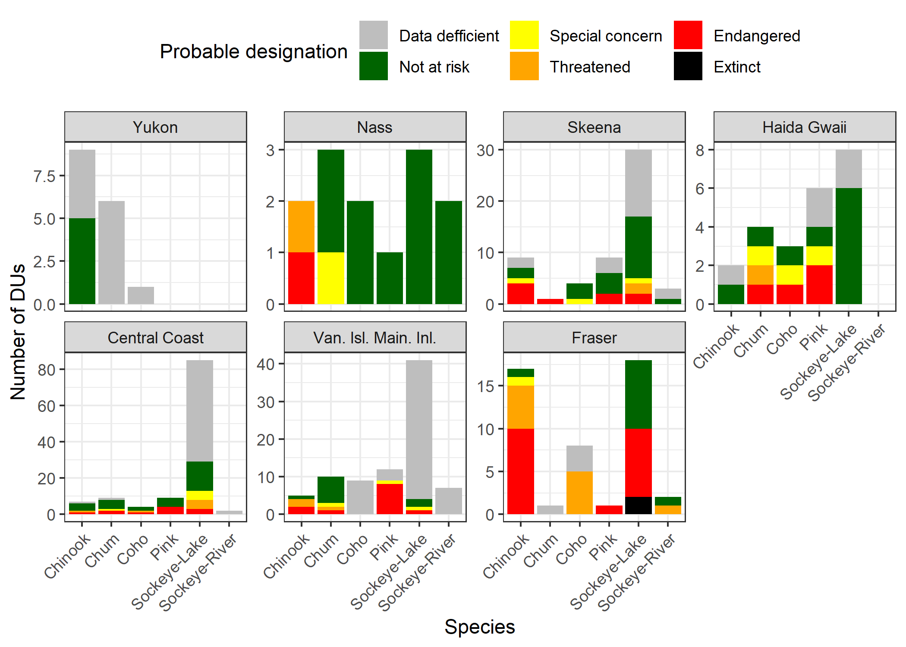
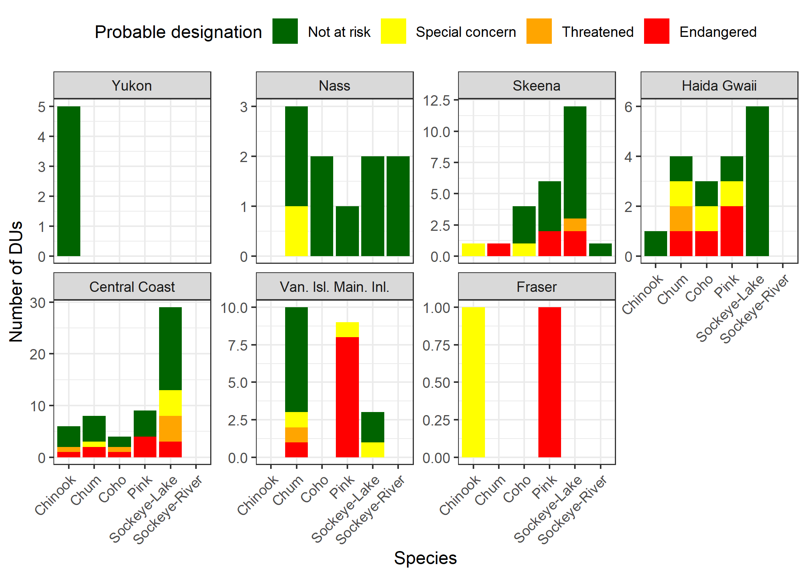

COSEWIC Pacific salmon DU probabale status’
================
10 August, 2022

-   [1 About](#1-about)
-   [2 Prioritization decison nodes](#2-prioritization-decison-nodes)
-   [3 Status summary](#3-status-summary)
    -   [3.1 All DUs](#31-all-dus)
    -   [3.2 Unassessed DUs](#32-unassessed-dus)
-   [4 Summary table](#4-summary-table)
    -   [4.1 Summary table all DUs](#41-summary-table-all-dus)
-   [5 Abundance plots](#5-abundance-plots)
    -   [5.1 Fraser](#51-fraser)
    -   [5.2 Van. Isl. Main. Inl.](#52-van-isl-main-inl)
    -   [5.3 Haida Gwaii](#53-haida-gwaii)
    -   [5.4 Central Coast](#54-central-coast)
    -   [5.5 Skeena](#55-skeena)
    -   [5.6 Nass](#56-nass)
    -   [5.7 Yukon](#57-yukon)
    -   [5.8 Columbia](#58-columbia)

# 1 About

This document summarizes estimates of change in mature individuals over
time for Pacific salmon Designatable Unit (DU) and associated probable
COSEWIC status designation. Data sources are detailed
[here](https://github.com/Pacific-salmon-assess/COSEWIC-prioritize#data-sources)
and all code to reproduce the analyses in this document is
[here](https://github.com/Pacific-salmon-assess/COSEWIC-prioritize).
These materials are solely intended to support the Marine Fishes
sub-committee of COSEWIC in identifying high priority DUs for COSEWIC to
consider when conducting formal status assessments.

# 2 Prioritization decison nodes

Initial thoughts on potential decision nodes in the prioritization
process.

1.  **Have DUs been formally defined by COSEWIC?** Chinook, sockeye, and
    coho salmon DUs have been defined (reports available
    [here](https://www.cosewic.ca/index.php/en-ca/reports/special-reports.html)),
    formal pink and chum DU identification is in progress. If **yes**
    then proceed.

2.  **Is information on mature individuals over time available at the DU
    scale?** If **yes** then proceed.

3.  **Has DU been previously assessed by COSEWIC?** If **yes** then
    consider a re-assessment, otherwise proceed except for DUs that have
    already been approved for a status assessment.

4.  **What is the DUs probable designation based on percentage change in
    mature individuals over past three generations?** If **special
    concern**, **threatened** or **endangered** then proceed.

5.  **Are there spatial considerations?** Are there commonalities in
    threats, designations, and/or data landscape at a regional scale
    that suggest a group of DUs should be bundled together?

# 3 Status summary

## 3.1 All DUs

**Figure 1**. Status of all DUs. For DUs that have been previously
assessed by COSEWIC the official status is shown, otherwise probable
status is inferred based on percent change in mature individual
abundance over the most recent three generations of data.

## 3.2 Unassessed DUs

**Figure 2**. Probable status of unassessed Pacific salmon DUs
(excluding those previously assessed by CPOSEWIC or recommended for
status assessment) based on rate of change in mature individuals over
most recent three generations.

# 4 Summary table

## 4.1 Summary table all DUs

The summaries for all DUs are available in a table
[here](https://github.com/Pacific-salmon-assess/COSEWIC-prioritize/blob/main/output/master-prob-status/master_status.csv).
A preview of the table is shown below.

    ##   Region   DU Species Generation length COSEWIC status % Change (recent)
    ## 1 Fraser  CK1 Chinook                 5     Threatened               457
    ## 2 Fraser CK10 Chinook                 5     Threatened               -63
    ## 3 Fraser CK11 Chinook                 5     Endangered               -46
    ## 4 Fraser CK12 Chinook                 4    Not at risk               -22
    ## 5 Fraser CK13 Chinook                 5     Endangered               -15
    ## 6 Fraser CK14 Chinook                 4     Endangered               -89
    ##   % Change (all) Recent abundance Last year Probable status      Status
    ## 1             32              103      2018     Not at risk  Threatened
    ## 2            -55             4684      2018      Threatened  Threatened
    ## 3            -14             7339      2018 Special concern  Endangered
    ## 4              4            37005      2018     Not at risk Not at risk
    ## 5             15              922      2018     Not at risk  Endangered
    ## 6            -55                4      2018      Endangered  Endangered

# 5 Abundance plots

## 5.1 Fraser

### 5.1.1 Chinook

<!-- --><!-- -->

### 5.1.2 Coho

<!-- --><!-- -->

### 5.1.3 Pink (Odd)

<!-- --><!-- -->

### 5.1.4 Sockeye

<!-- --><!-- --><!-- --><!-- -->

## 5.2 Van. Isl. Main. Inl.

### 5.2.1 Chinook

<!-- --><!-- -->

### 5.2.2 Chum

<!-- --><!-- -->

### 5.2.3 Pink (Even)

<!-- --><!-- -->

### 5.2.4 Pink (Odd)

<!-- --><!-- -->

### 5.2.5 Sockeye

<!-- --><!-- -->

## 5.3 Haida Gwaii

### 5.3.1 Chinook

<!-- --><!-- -->

### 5.3.2 Chum

<!-- --><!-- -->

### 5.3.3 Coho

<!-- --><!-- -->

### 5.3.4 Pink (Even)

<!-- --><!-- -->

### 5.3.5 Pink (Odd)

<!-- --><!-- -->

### 5.3.6 Sockeye

<!-- --><!-- -->

## 5.4 Central Coast

### 5.4.1 Chinook

<!-- --><!-- -->

### 5.4.2 Chum

<!-- --><!-- -->

### 5.4.3 Coho

<!-- --><!-- -->

### 5.4.4 Pink (Even)

<!-- --><!-- -->

### 5.4.5 Pink (Odd)

<!-- --><!-- -->

### 5.4.6 Sockeye

<!-- --><!-- --><!-- --><!-- -->

## 5.5 Skeena

### 5.5.1 Chinook

<!-- --><!-- -->

### 5.5.2 Chum

<!-- --><!-- -->

### 5.5.3 Coho

<!-- --><!-- -->

### 5.5.4 Pink (Even)

<!-- --><!-- -->

### 5.5.5 Pink (Odd)

<!-- --><!-- -->

### 5.5.6 Sockeye

<!-- --><!-- -->

## 5.6 Nass

### 5.6.1 Chinook

<!-- --><!-- -->

### 5.6.2 Chum

<!-- --><!-- -->

### 5.6.3 Coho

<!-- --><!-- -->

### 5.6.4 Pink (Odd)

<!-- --><!-- -->

### 5.6.5 Sockeye

<!-- --><!-- -->

## 5.7 Yukon

### 5.7.1 Chinook

<!-- --><!-- -->

## 5.8 Columbia

### 5.8.1 Chinook

<!-- --><!-- -->
